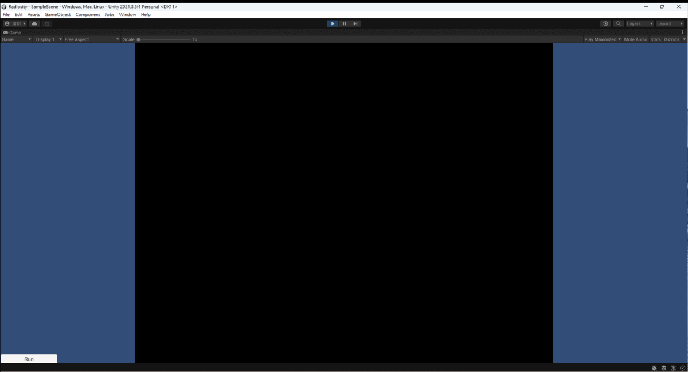
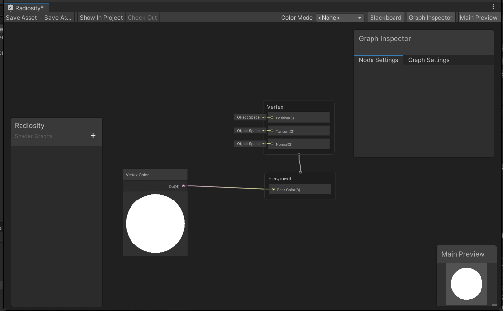
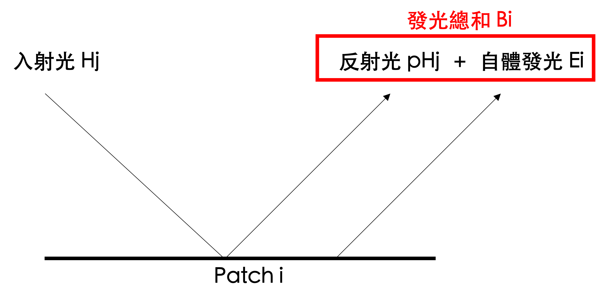
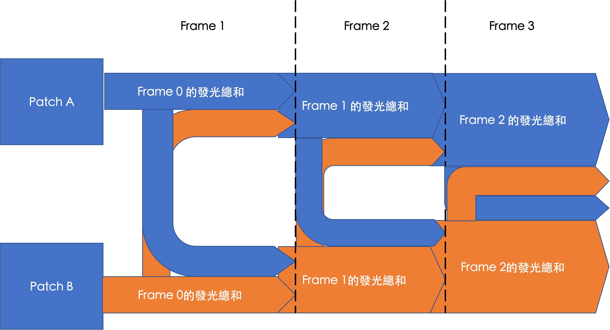
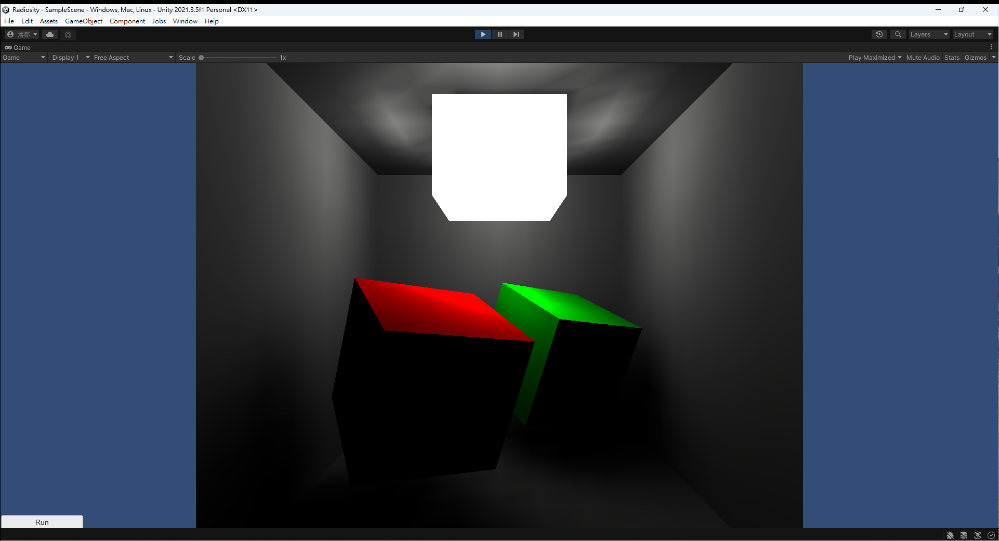
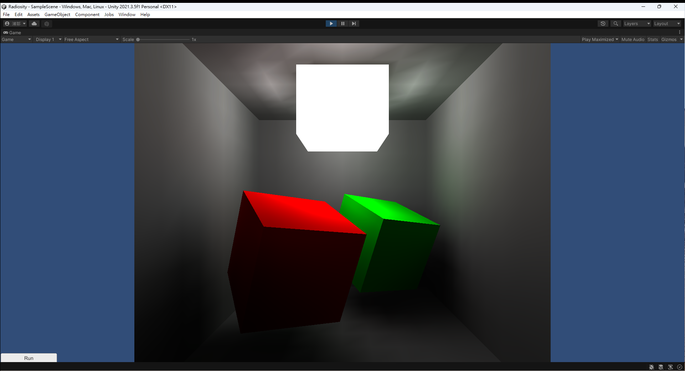
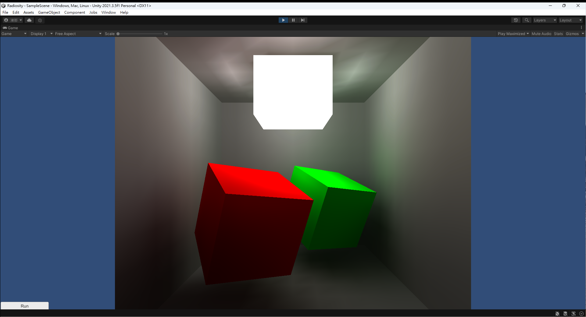

# Radiosity



## Introduction

本篇採用 Unity 來實作 Radiosity。

本篇將依序介紹從 Mesh 生成、上色與演算法的部分。

## Mesh 生成

如何生成 Mesh 的部分可以看 `FaceGenerator.cs` 。
為了呈現好畫面，我選擇使用 Cornell Box 的概念做自己的場景，簡單來說就是幾個 Cube 在場景中，一個光源打下來，不同顏色的 Cube 互相影響下的顏色呈現。
而 Radiosity 有一個重點是，要把一個大面切成好幾個小面，這樣的小面在演算法中被稱為 Patch，用類似積分的概念去運算每個小面與小面之間互相影響的程度。當然這樣的壞處就是運算量過於龐大，但沒辦法，這也是為什麼 Radiosity 的畫面很漂亮的原因，每個面互相反射所帶來的對方顏色的光澤才能互相呈現出來。

本次皆是使用 Cube 來做渲染， Progressive Radiosity 是窮舉的方式，每個面都要相互運算，所以我想說用 Cube 可以減少運算量，原因是因為同一個平面上的 Patch 其法向量是互相平行的，如果我是找一個，也就是說他們之間的是沒有反射光的，這樣我只要 Cube 的六面間的 Patch 進行交互運算即可，同一個面上的 Patch 之間的運算可以省略跳過。
我是使用程式來生成 Cube Mesh，這樣的好處是我可以自己決定每個面的 Patch 數量，並且自己為每個 Patch 對應的點與三角形建立 Class 來記錄資訊。而這個專案中的 Patch 指的即是由兩個三角形所組成的四邊形。
以下是我把一個面如何建好 Mesh 的過程（此段擷取自 `FaceGenerator.cs`）：

``` C#
private void CreateMesh()
{
    float patchWidth = range / size;
    float patchArea = patchWidth * patchWidth;

    for (int h = 0; h <= size; h++)
    {
        for (int v = 0; v <= size; v++)
        {
            var vertexId = v * (size + 1) + h;
            var vertexPos
                = new Vector3(1, 1, 0) * -(range / 2.0f)
                + patchWidth * new Vector3(h, v, 0);

            vertices[vertexId] = new Vertex(this, vertexId, vertexPos);
            colors[vertexId] = vertices[vertexId].color;

            if (v == 0 || h == 0)
                continue;

            int patch_v = (v - 1);
            int patch_h = (h - 1);
            var patchId = patch_v * size + patch_h;

            var lt = vertices[(v - 1) * (size + 1) + (h - 1)];
            var lb = vertices[(v) * (size + 1) + (h - 1)];
            var rb = vertices[(v) * (size + 1) + (h)]; // vertexId
            var rt = vertices[(v - 1) * (size + 1) + (h)];

            if (!outside)
            {
                var tmp = lb;
                lb = rt;
                rt = tmp;
            }

            triangles[patchId * 6 + 0] = lt.id;
            triangles[patchId * 6 + 1] = lb.id;
            triangles[patchId * 6 + 2] = rt.id;
            triangles[patchId * 6 + 3] = lb.id;
            triangles[patchId * 6 + 4] = rb.id;
            triangles[patchId * 6 + 5] = rt.id;

            patches[patch_v * size + patch_h] = new Patch(patchId, this, patchArea, lt, lb, rt, rb);
        }
    }

    mesh.Clear();

    mesh.vertices = vertices.Select(vertex => vertex.position).ToArray();
    mesh.triangles = triangles;
    mesh.colors = colors;

    mesh.RecalculateNormals();
    mesh.RecalculateTangents();
}
```

可以看到我每升成一個點就建立一個 Vertex 物件，並且直到我第一行第一列的點都建好後，剩下的點才會開始建立 Patch (#18)；若 Cube 要朝內，則須改變頂點順序 (#30 ~ #35)；Patch 所需要的即是其四個頂點、面積等資訊，因此於建構時提供之 (#44) ；最後把所有生成好的 data 餵給 mesh 即可。
程式中我們可以看到 colors ，也就是 Vertex Color 的部分，此部分是因為我們改變 Patch 的顏色後是餵給 Vertex Color 來讓 Shader 上色，此部分於上色環節會提到。

是說，不止 Cube ，法向量向外的 Sphere 也可以啦，畢竟球體的每個面的法向量都是朝外的，它們甚至都沒有互相對著對方，於等一下的演算法之中會提到兩個 Patch 的法向量要互相指著對方才會有反射光成立 （是說直接用直觀的物理思考也可以理解啦），但如果是向內的球體那就慘了，每個 Patch 都是對著彼此的。

## 上色

於上面 mesh 的部分有提到，每個 Patch 是由兩個三角形組成的四邊形，也就是每個 Patch 一定有四個頂點資訊，反之，一個頂點也有記錄最多四個 Patch 的資訊 （若是角落點或是邊上的點就不一定是四個 Patch），此處我們若要幫 mesh 上色，我們就要提供 Vertex Color。
我的做法是，把這個 Vertex 相關的 Patch （最多四個）加起來平均後，就是這個 Vertex 的顏色，並餵給 Shader 進行渲染：

``` text
vertex color = average(all patch's color related to this vertex)
```

而 Shader 我是採用 Shader Graph 的方式拉了個簡單的 Shader，也就是把 Vertex Color 直接餵給 Fragment Shader 的輸出顏色。如下方所示。



因為 Shader Graph 真的很方便，但 Unity 的 Shader Lab 寫法我還要花一點時間研究（以前寫過 OpenGL 的 HLSL?，但沒寫過 Unity 的）。所以就還是用 Shader Graph 來做了。這邊可以看到我把很多沒必要且影響顏色的 Property (like: Emission, Smooth…) 移除，只使用 Base Color ，以免其他東西影響最後顏色的形成。

## Algorithm

### 發光總和

先簡單來講一下， Radiosity 就是自體發光加上接受到的光的反射這兩項的總和，也就是如下圖所示。若假設入射光的能量為 Hj ，則該 Patch i 換反射折射率 p 以後的能量。舉個例子若 p 是 0.6，也就是說 Patch 會反射 60% 的光線，其中 40% 會被 Patch 吸收。



``` text
Bi = ΣpHj + Ei
```

而入射光 Hj 則是來自另一個 Patch j 的反光或自體發光，而我是下回合（下幀）才會再次考慮計算，也就是說每回合會先拿上回合該 Patch 的發光總和計算，但是算完的結果是給下個回合當作發光總和使用。每經過一回合的疊加顏色都會更精準一點。如下圖所示。



### 入射光

入射光剛剛提到是 Hj，是發光 Patch j 的總發光亮 Bj 乘以兩 Patch 之間的 Form Factor (Fij)。

``` text
Hj = Bj * Fij
```

其中 Form Factor 公式如下：

``` text
F12 = cosθ1 * cosθ2 / (πs²) * A2
```

這邊只要把 1 和 2 想像成 Patch i 和 Patch j 即可，而從上圖來解釋的話：假設 A2 是發光體，則對 A2 來說發光最強的方向就是法線 n2 的方向，假設 A1 是受光體，則對 A1 來說壽光最強的方向就是法線 n1 的方向。也就是說若發射角與入射角都不是在兩條法線上，則需要乘以兩個角的 cos 值來衰減兩次。分母放距離平方也很好理解，代表距離越遠光的強度衰減越多。

從這個公式可以解釋方才為何要提到`兩個 Patch 要互相面對才行了`，因為若兩向量沒有互相看著對方代表 cosθ1 和 cosθ2 至少其中之一為負，也就代表兩著間夾角為鈍角，這種狀況下是不可能發生反射的。

## Process

這邊介紹一下我運作的方式

1. `CheckVisibility`: 檢查每個 Patch 之間的可視狀態。
2. `ApplyPatchToPatch`: 計算每個 Patch 之間的顏色。
3. `ApplyPatchColor`: 替換新舊 color。
4. `ApplyVertexColor`: 將顏色實際上丟到 Vertex Shader 中。

### CheckVisibility

於最一開始一定是先檢查每個 Patch 之間的可視狀態，這個狀態很重要，因為有了這個確認，才會有陰影的產生，畫面有才不會無限回授而感覺上有過曝的感覺。

於每個演算法開始時，一定都會有這個步驟，每個 Patch 有各自的一個 Dicionary 去紀錄其對於其他 Patch 的可是狀態，我把這個狀態下的所有資訊都總結在一個資料結構 `PatchToPatchData` 下，這個結構紀錄了各種有用的資訊，其初始化狀態如下：

``` C#
public PatchToPatchData(Patch patch1, Patch patch2)
{
    this.patch1 = patch1;
    this.patch2 = patch2;

    dis = patch2.center - patch1.center;
    length = dis.magnitude;
    dir = dis.normalized;

    float dot1 = Vector3.Dot(dir, patch1.normal);

    if (dot1 < 0)
        return;

    float dot2 = Vector3.Dot(-dir, patch2.normal);

    if (dot2 < 0)
        return;

    fCommon = dot1 * dot2 / (Mathf.PI * length * length) * patch1.area * patch2.area;
    f12 = fCommon / patch1.area;
    f21 = fCommon / patch2.area;

    RaycastHit hit;

    if (Physics.Raycast(patch1.center, dir, out hit))
    {
        if (hit.transform == patch2.face.transform)
        {
            visible = true;
        }
    }
}
```

由上方程式碼中可以看到，當兩個 dot 有其中一個為負就 `return` ， `visible` 也就不可能為 `true` 若 visible 為 `false` 其待會於運算時這兩個 Patch 之間就會跳過運算。

而 Raycast 測試就更單純了，從 Patch1 的中新網 Patch2 的 center，看看會不會撞到 patch2 的面即可，有撞到彼此就代表兩者間無障礙物，可以看到對方。這邊我在設計上有個不靈活的地方是，我碰撞判定只看撞到的 Mesh 是不是跟 patch2 同一個 mesh，但有可能我撞到的三角形是在同一個 mesh 沒錯，但並不是 Patch2 的三角形，但因為我現在是用 Cube，所以不會有這個問題，但日後我使用圓形或其他多邊形時可能就會有問題了，之後要改的話可能會改為比對 `triangleId。`

這邊小提一下，我採用的 collider 是 `MeshCollider，只要在` mesh 建好後，把建好的 Mesh 餵給 `MeshCollider` 的 `shadredMesh` 即可生成一樣的 Collider 了。

### ApplyPatchToPatch

當於 `CheckVisibility` 的環節後，我們就可以知道哪些 Patch 互相看得到看不到，並且也會有已經計算好的 Form Factor，因此就可以開始來計算顏色。但在計算顏色之前，我要先介紹一下我的機制，我有兩個變數用來記錄顏色，分別是：

1. `color`: 上回合算出的顏色，提供給這回合其他 Patch 當作入射光使用
2. `newColor`: 這回合算出來的顏色，為自體發光加上來自其他所有 Patch 的入射光。

有了這個概念就可以來看下方的程式碼了：

``` C#
public void ApplyPatchToPatch(Patch anotherPatch)
{
    if (anotherPatch == this)
        return;

    if (!p2pDatas.ContainsKey(anotherPatch))
        return;

    PatchToPatchData data = p2pDatas[anotherPatch];

    if (!data.visible)
        return;

    newColor += face.faceColor * anotherPatch.color * data.f12 * face.reflectFactor;
}
```

防呆機制先跳過，首先就是先確認可對視否，也就是上個環節 `CheckVisibility` 做過的內容，在確定兩個 Patch 為可對視後，我們就會拿別的 Patch (anotherPatch) 的 `color` 乘以 Form Factor (F12) 與折射率 (p)，並加入 `newColor` 中。

各位會覺得其怪，這一段是把我所有的反光加總起來，那我的自體發光那段去哪了。因為自體發光只能加一次，因此我是在後面 `ApplyPatchColor` 的時候才加，之後再講 `ApplyPatchColor` 時候會講到。

### ApplyPatchColor

此處很單純，即是因為一輪計算結束，將算出來的新顏色取代掉舊的顏色後， `newColor` 加上自體發光的部分以開始新的一輪運算。

``` C#
public void ApplyPatchColor()
{
    color = newColor;
    newColor = face.GetSelfLightInstance();
}
```

而此處的自體發光 Function 如下：

``` C#
public Color GetSelfLightInstance()
{
    return faceColor * lightInstance;
}
```

即是該表面的顏色乘以發光的強度。

### ApplyVertexColor

當 Patch 顏色被更新後，即可開始更新 Vertex Color，而更新的方式也是直接 Call `Patch` 中的 `ApplyVertexColor`：

``` C#
class Patch
{
    public void ApplyVertexColor()
    {
        lb.ApplyColor();
        lt.ApplyColor();
        rb.ApplyColor();
        rt.ApplyColor();
    }
}
```

而 Patch 會再去 Call 每個 Vertex 各自的顏色，簡單來就是看有幾個 Patch 相連就算平均值：

``` C#
class Vertex
{
    public void ApplyColor()
    {
        int patchCount = patches.Count;

        if (patchCount == 0)
            return;

        face.colors[id] = Color.black;

        foreach (var patch in patches)
            face.colors[id] += patch.color / patchCount;
    }
}
```

## 實驗結果

於一開始的時候，沒有任何光被運算。因為連自體發光都還沒運算，所以是一片漆黑：


系統剛開始，還沒有按 Run在按了第一次 Run 後，系統會大量運算 Patch 與 Patch 之間是否可以直接可視對方，我這邊是採用 Raycast 做運算，所以會花費大量時間，但算過後會記錄起來可視的狀態，下回合就不用再運算了。也可以看到第一次 Run 完後雖然有光了，但畫面還是很暗，因為第一次運算只有自體發光還沒有環境中其他 Patch 的反射光。



按了第一次 Run，執行了第一輪 Radiosity而在第二輪 Run 按下去後，可以看到因為有了環境光的影響，畫面變得更亮了，原本背光的地方漸漸有了顏色，且仔細注意可以發現，右邊的白牆上有綠色方塊反射的微微綠光。



第二次按下 Run 的結果，執行兩輪 Radiosity下圖是第六次按下 Run 後的成果，可以看到畫面變得更亮，且不只右邊白牆有綠色的反光，左邊的白牆也有些微的紅色反光。



## Conclusion

自從想踏入遊戲業，學了圖學之後，看到那些又帥又屌的圖學特效話高品質渲染都會心動不已，在學生時期看到 Radiosity 和 Raytracing 的時候也有這種感覺，覺得好屌喔好想自己有動手試試看，但最後因為自己太混圖學都沒有好好學跑去搞 AI 而錯過了，所以現在也算是圓了當時還是學生時期的夢，弄了一個自己的 Radiosity 出來。

根據我的作法，看起來是可以不需要用 Unity，用 C++ 和 OpenGL 也可以實作出來，反正 mesh 的拉法也是複製貼上改一下，上色用一個簡單的 Shader，然後算出來的顏色直接丟給 vertex data 即可，好像沒有很困難。
